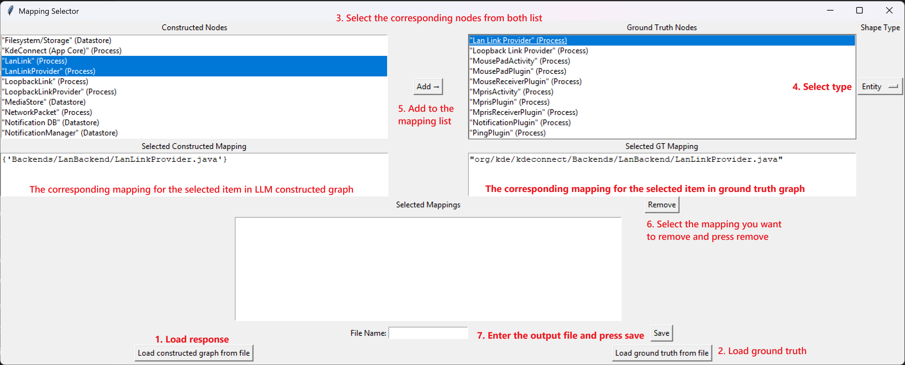

# Running the tools:
To run the tools, install the required packages
```bash
    pip install -r requirements.txt
    python main.py
```

# Tool usage:
1. Load the LLM response file with "Load constructed graph from file" button. The response file is usually in the following format: **[prompt-technique]-log.txt**. 

2. Load the benchmark file with "Load ground truth from file" button.

3. Select the items from the list that you want to make a corresponding mapping. The corresponding window will show you the mapping in each of the graph. (You don't need to manually add single node, if they don't have the corresponding node on the other side. This will be done automatically when saving the file.)

4. Select the corresponding shape from the list

5. Use the add button to add the mapping to the mapping list. There is a mechanism that shows you a warning if there is a type mismatch. However, the mapping is still added to the mapping list, and you will need to manually remove it later.

6. In case you find a mapping that is not correct. You can remove it with the remove button and restart from step 3.

7. Enter the name of the output file and press save. The unselected nodes will automatically be added as a single node.



# Merging criteria.
Since the code mapping in the LLM-generated graph is not complete. Some of the nodes in the graph often don't have the corresponding code mapping.

The process that I used for the grouping is as follow.
1. Node with the same shape and the same name creates a graph-ground truth mapping. (Do not consider the corresponding code mapping at this stage)

2. Processes within the same package/folder can be merged into the same group. For example, nodes with the following code mappings: "Backends/LanBackend/LanLinkProvider.java", "Backends/LanBackend/LanLink.java", can be merged into node with "Backends/LanBackend/*" in the ground truth graph

3. Since LLM does not often generate code mapping for entities and datastore. This is the list of common grouping method that I used.

    - Android components (usually with name started with "Android ...") can be merged together and map to the Android OS entity in the LLM-constructed graph.
    - Android preferences (usually with name ended with "... preference") can be merged together and map to the Shared Preference in the LLM constructed graphs.

# Evaluation:
To run the evaluation, modify the following parameter in the eval file before running it: 
``` python
CONSTRUCTED_FILE = rf'samples/zero-shot-log.txt' # LLM response file
GROUND_TRUTH_FILE = rf'samples/benchmark.txt' # Ground truth file 
filename = f"fscot-4.1-mini-new.py" # The tool output file
```


After changing to the correct file, run
```bash
python eval.py
```
